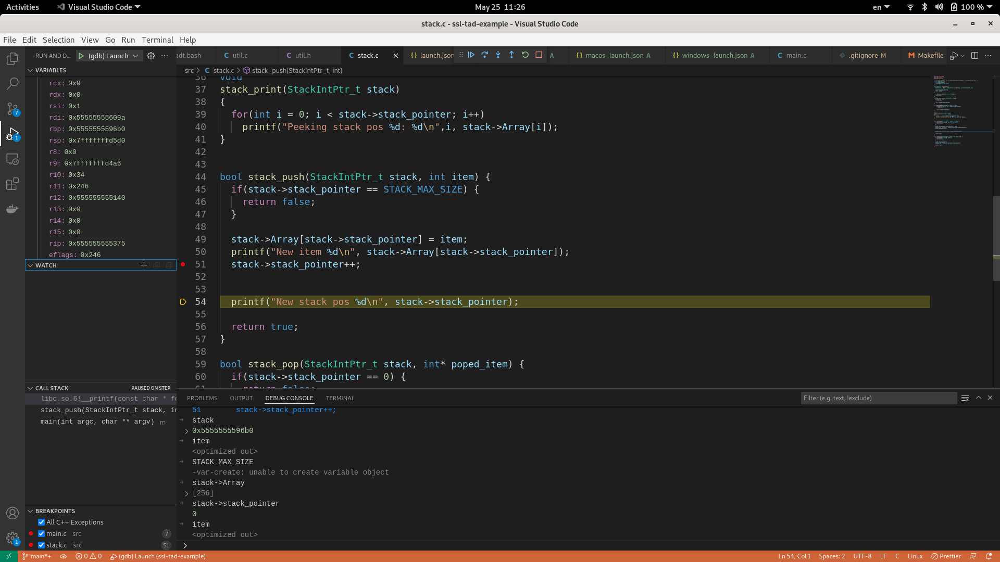

== Antes de empezar

:vscode_webpage: footnote:[https://code.visualstudio.com/]
:debugging_manual: footnote:[https://www.eecs.umich.edu/courses/eecs373/readings/Debugger.pdf]
:gdb_webpage: footnote:[https://www.sourceware.org/gdb/]

=== Objetivo

Este documento describira los pasos para poder empezar a utilizar el modo de `depuracion` (debugging) en VSCode en Linux, MacOS y Windows.

Este documento tiene como proposito, describir los requisitos, y pasos a seguir para poder utilizar el depurador de C `gdb` en Linux y windows.

NOTE: La eleccion de Visual Studio Code{vscode_webpage}, fue debido a que la mayoria de los alumnos que cursan _Sintaxis y Semantica de los Lenguajes_ utiliza dicho entorno para programa en C.

=== Que es un depuarador (debugger)?

El proposito de un depurador (`debugger`), tal como lo es `gdb`{gdb_webpage}, es el de permitir ver lo que hay "adentro" de otro programa miento se ejecuta, o lo que este otro programa estaba haciendo antes de fallar.

EL depurador `gdb` puede hacer cuatro tareas principales, existen muchas cosas mas que pueden hacer pero las que nombraremos son las principales:

* Inicializar un programa, especificando cualquier cosa que afecte su comportamiento.
* Poder parar la ejecucion del programa en condiciones especificas, por medio de `breakpoints` (puntos de corte)y condiciones de punto de corte.
* Examinar e investigar que ha sucesido con el program, cuando la ejecucion se detuvo por un punto de corte.Examine what has happened, when your program has stopped.
* Cambiar cosas en el programa, para poder experimentar los cambios que generarian en el programa dichos cambios.

Ademas este depurador, funciona en muchos lenguajes, por lo que puede usarse esta misma herramienta en ellos. Los lenguajes que soporta `GDB` son:

* Assembly
* *C/C++*
* D
* Go
* Objective-C
* Pascal
* Rust

NOTE: Esta guia detallara los pasos para depurar codigo solo en _C/C++_.

==== Por que no usar gdb directamente?

Si bien `GDB` puede utilizarse sin necesidad de usar `Visual Studio Code`, se recomienda usar este por medio de este entorno, debido a que la interfaz que expone `GDB` puede ser algo dificil de dominar al comienzo{debugging_manual}.

Ademas Visual Studio Code, no posee un depurador por su cuenta, sino que utilizaremos el depurador `gdb`, que es bastante potente, y el entorno de VScode, nos dara una interfaz mucho mas amigable sin renunciar a utilizar el depurador _de facto_ de _C/C++_.

==== Que beneficios nos brinda depurar en Visual Studio Code?

Tal como se menciono antes, Visual Studio Code utilizara el depurador `gdb`, y permitira que se pueda depurar codigo, de manera simple, y que se puedan establecer `breakpoints` sin necesidad de tener que modificar o agregar lineas adicionales a nuestro codigo existente.

Con `gdb` en `Visual Studio Code` podremos hacer lo siguiente:

* Puntos de corte (Break points)
** break points
** condition break points
** function break points
* Tipos de ejecucion en modo depuracion
** Step Over
** step into
** Step out
** Continue
* Call Stack
* Variables
** Ver variables
** Observar variables (watch variables)

Desgraciadamente no podemos hacer las siguientes acciones en modo depuracion con gdb en Visual Studio Code:

* Step Back
* Move to